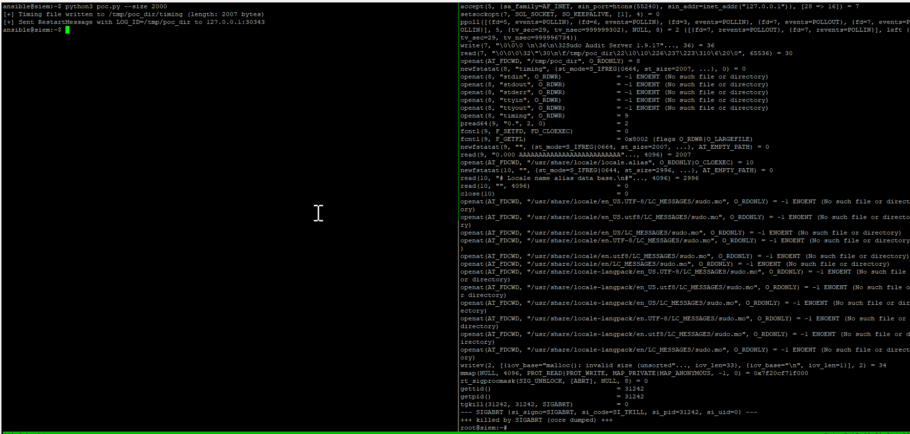

# Proof of Concept (PoC) — `sudo_logsrvd` directory-traversal → memory corruption

**Proof of Concept (PoC) for a directory-traversal → memory corruption vulnerability in `sudo_logsrvd` (Sudo project). This PoC demonstrates how a local, unprivileged user can supply a crafted `log_id` containing path-traversal sequences that cause `sudo_logsrvd` to read attacker-controlled files, leading to memory corruption and a crash (local DoS).**  
**Do not run this PoC on production systems.**

**Note:** this uses a *timing* file. The payload inside the timing file triggers the crash and may be part of an exploit chain that results in local privilege escalation (LPE).

  

